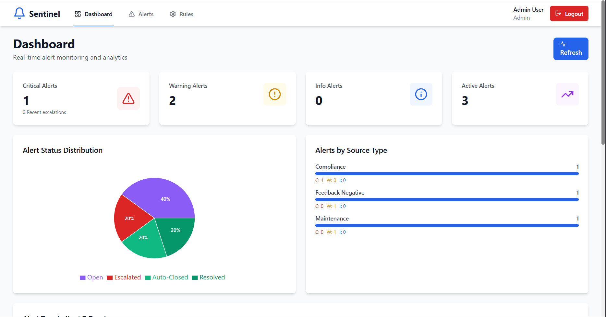
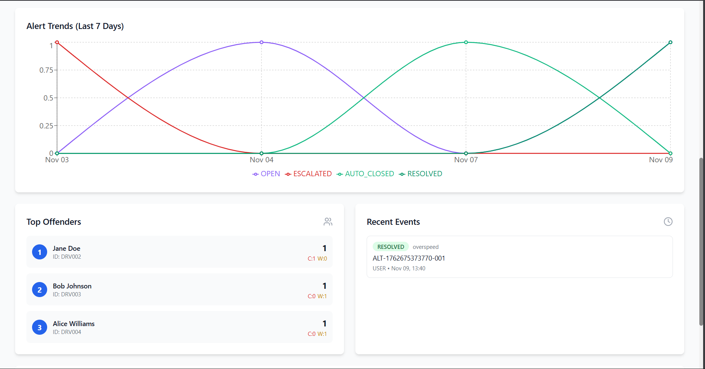
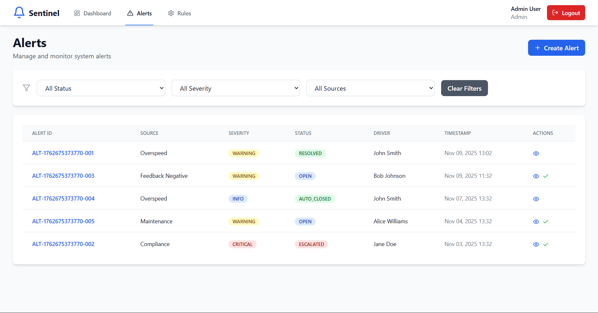
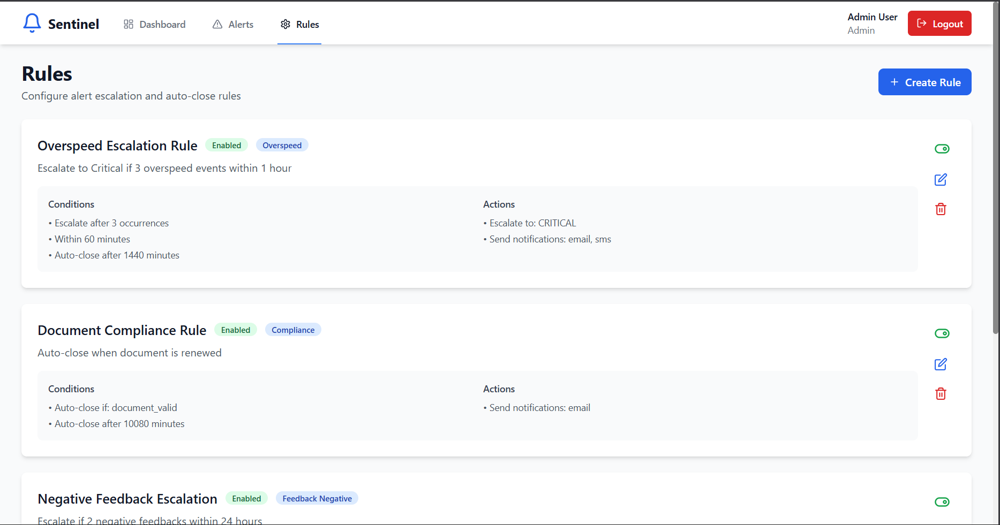
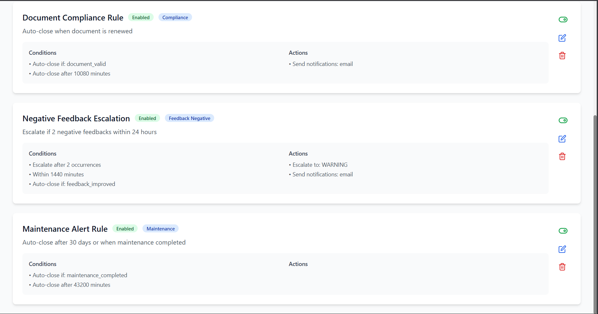
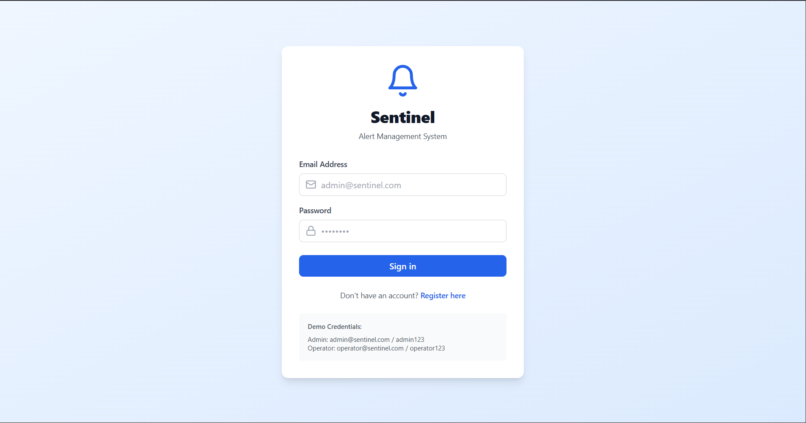

# Sentinel - Intelligent Alert Escalation & Resolution System

  

## 📋 Table of Contents

- [Overview](#overview)
- [Features](#features)
- [Architecture](#architecture)
- [Tech Stack](#tech-stack)
- [Getting Started](#getting-started)
- [API Documentation](#api-documentation)
- [System Design](#system-design)
- [Performance Analysis](#performance-analysis)
- [Screenshots](#screenshots)
- [Demo](#demo)
- [Contributors](#contributors)

## 🎯 Overview

**Sentinel** is an intelligent alert management system designed for **MoveInSync** fleet operations. It automatically escalates, de-escalates, and closes alerts based on dynamic, configurable rules, providing real-time visibility through a comprehensive dashboard.

### Problem Statement

MoveInSync operates multiple fleet-monitoring modules (Safety, Compliance, Feedback) that generate alerts like overspeeding, expiring documents, or poor driver feedback. These alerts currently require manual review, creating operational bottlenecks. Sentinel solves this by:

- **Automating** alert escalation based on configurable rules
- **Auto-closing** alerts when conditions are met
- **Providing** real-time dashboards for monitoring
- **Tracking** complete alert lifecycle history

## ✨ Features

### 1. Centralized Alert Management
- ✅ Unified API for ingesting alerts from multiple sources
- ✅ Normalized storage format: `{alertId, sourceType, severity, timestamp, status, metadata}`
- ✅ State transitions: `OPEN → ESCALATED → AUTO-CLOSED → RESOLVED`

### 2. Lightweight Rule Engine
- ✅ Configurable DSL-like rule system
- ✅ Dynamic rule evaluation without hardcoding
- ✅ Support for time-window based conditions
- ✅ Example rules:
  - Overspeed: Escalate if 3+ events within 60 minutes
  - Compliance: Auto-close when document renewed
  - Feedback: Escalate if 2+ negative feedbacks in 24 hours

### 3. Auto-Close Background Job
- ✅ Periodic worker (cron-based) scanning alerts
- ✅ Idempotent operations (safe to re-run)
- ✅ Automatic state transitions based on conditions
- ✅ Audit trail of all auto-closure events

### 4. Interactive Dashboard
- ✅ Real-time severity and status distribution
- ✅ Top 5 drivers with most alerts
- ✅ Recent alert lifecycle events
- ✅ Auto-closed alerts transparency
- ✅ 7-day trend analysis charts
- ✅ Alert drill-down with full history

### 5. Robust Authentication
- ✅ JWT-based authentication
- ✅ Role-based access control (User, Operator, Admin)
- ✅ Secure password hashing (bcrypt)
- ✅ Protected API routes

### 6. Advanced Features
- ✅ **Caching**: In-memory caching for dashboard data (node-cache)
- ✅ **Error Handling**: Comprehensive error recovery procedures
- ✅ **Logging**: Winston logger with structured logging
- ✅ **Monitoring**: System health endpoints and statistics
- ✅ **Security**: Helmet, CORS, rate limiting

## 🏗️ Architecture

```
┌─────────────────────────────────────────────────────────────┐
│                     FRONTEND (React + Vite)                  │
│  ┌──────────┐ ┌──────────┐ ┌──────────┐ ┌──────────┐       │
│  │Dashboard │ │ Alerts   │ │  Rules   │ │   Auth   │       │
│  └──────────┘ └──────────┘ └──────────┘ └──────────┘       │
└────────────────────────┬────────────────────────────────────┘
                         │ HTTP/REST API
┌────────────────────────┴────────────────────────────────────┐
│                  BACKEND (Node.js + Express)                 │
│  ┌──────────────────────────────────────────────────────┐   │
│  │              API Routes & Controllers                 │   │
│  │  • Auth   • Alerts   • Dashboard   • Rules          │   │
│  └──────────────────────┬───────────────────────────────┘   │
│                         │                                    │
│  ┌──────────────────────┴───────────────────────────────┐   │
│  │              Services Layer                           │   │
│  │  • Rule Engine     • Background Jobs                 │   │
│  │  • Cache Manager   • Logger                          │   │
│  └──────────────────────┬───────────────────────────────┘   │
│                         │                                    │
│  ┌──────────────────────┴───────────────────────────────┐   │
│  │              Middleware                               │   │
│  │  • Authentication  • Error Handler  • Validation     │   │
│  └──────────────────────────────────────────────────────┘   │
└────────────────────────┬────────────────────────────────────┘
                         │
┌────────────────────────┴────────────────────────────────────┐
│                    MongoDB Database                          │
│  • Users Collection    • Alerts Collection                   │
│  • Rules Collection    • AlertHistory Collection             │
└─────────────────────────────────────────────────────────────┘
```

## 🛠️ Tech Stack

### Backend
- **Node.js** - Runtime environment
- **Express.js** - Web framework
- **MongoDB** - NoSQL database
- **Mongoose** - ODM for MongoDB
- **JWT** - Authentication
- **bcryptjs** - Password hashing
- **node-cron** - Background jobs
- **Winston** - Logging
- **node-cache** - In-memory caching
- **Helmet** - Security headers
- **express-rate-limit** - Rate limiting

### Frontend
- **React 19** - UI framework
- **Vite** - Build tool
- **React Router** - Routing
- **Axios** - HTTP client
- **Recharts** - Data visualization
- **Tailwind CSS** - Styling
- **Lucide React** - Icons
- **React Hot Toast** - Notifications
- **date-fns** - Date formatting

## 🚀 Getting Started

### Prerequisites

```bash
- Node.js >= 16.x
- MongoDB >= 5.x
- npm or yarn
```

### Installation

#### 1. Clone the repository

```bash
git clone https://github.com/spiderOO7/moveinsync-sentinel.git
cd moveinsync-sentinel
```

#### 2. Backend Setup

```bash
cd backend
npm install

# Create .env file
cp .env.example .env

# Update .env with your MongoDB URI
# MONGODB_URI=mongodb://localhost:27017/sentinel

# Seed database with sample data
node seed.js

# Start backend server
npm run dev
# Server runs on http://localhost:5000
```

#### 3. Frontend Setup

```bash
cd frontend
npm install

# Start frontend development server
npm run dev
# Frontend runs on http://localhost:5173
```

### 🔐 Default Credentials

```
Admin User:
Email: admin@sentinel.com
Password: admin123

Operator User:
Email: operator@sentinel.com
Password: operator123
```

## 📚 API Documentation

### Authentication Endpoints

```http
POST /api/auth/register
POST /api/auth/login
GET  /api/auth/me
PUT  /api/auth/profile
```

### Alert Endpoints

```http
GET    /api/alerts              # Get all alerts with filters
POST   /api/alerts              # Create new alert
GET    /api/alerts/:id          # Get single alert
PUT    /api/alerts/:id          # Update alert
PUT    /api/alerts/:id/resolve  # Resolve alert
DELETE /api/alerts/:id          # Delete alert (Admin only)
```

### Dashboard Endpoints

```http
GET /api/dashboard/overview      # Get severity and status counts
GET /api/dashboard/top-offenders # Get top 5 drivers with most alerts
GET /api/dashboard/recent-events # Get recent alert lifecycle events
GET /api/dashboard/auto-closed   # Get recently auto-closed alerts
GET /api/dashboard/trends        # Get 7-day alert trends
GET /api/dashboard/by-source     # Get alerts grouped by source type
```

### Rule Endpoints

```http
GET    /api/rules          # Get all rules
POST   /api/rules          # Create rule (Admin only)
GET    /api/rules/:id      # Get single rule
PUT    /api/rules/:id      # Update rule (Admin only)
DELETE /api/rules/:id      # Delete rule (Admin only)
PATCH  /api/rules/:id/toggle # Toggle rule enabled/disabled (Admin only)
```

### Alert Creation Example

```json
POST /api/alerts
{
  "sourceType": "overspeed",
  "severity": "WARNING",
  "metadata": {
    "driverId": "DRV001",
    "driverName": "John Doe",
    "vehicleNumber": "MH-01-AB-1234",
    "speed": 85,
    "speedLimit": 60,
    "location": "Highway NH-48"
  }
}
```

### Rule Creation Example

```json
POST /api/rules
{
  "ruleId": "RULE_OVERSPEED_001",
  "sourceType": "overspeed",
  "name": "Overspeed Escalation Rule",
  "description": "Escalate to Critical if 3 overspeed events within 1 hour",
  "enabled": true,
  "priority": 10,
  "conditions": {
    "escalate_if_count": 3,
    "window_mins": 60,
    "auto_close_after_mins": 1440
  },
  "actions": {
    "escalate_to_severity": "CRITICAL",
    "notify": true,
    "notificationChannels": ["email", "sms"]
  }
}
```

## 🔍 System Design

### Time & Space Complexity Analysis

#### Alert Operations
- **Create Alert**: O(log n) - Indexed insertion
- **Find Alert by ID**: O(log n) - Index lookup
- **Filter Alerts**: O(log n + k) - Index scan + result set
- **Update Alert**: O(log n) - Index lookup + update

#### Rule Engine
- **Evaluate Single Alert**: O(a) where a = alerts in time window
- **Batch Processing**: O(n × a) where n = alerts to process
- **Rule Lookup**: O(1) - Hash map lookup

#### Dashboard Aggregations
- **Overview Stats**: O(n) - Full collection scan with aggregation
- **Top Offenders**: O(n log n) - Sort operation
- **Trends**: O(n) - Time-based aggregation
- **Cache Hit**: O(1) - In-memory lookup

#### Space Complexity
- **Per Alert Document**: O(1) - Fixed size
- **Alert History**: O(h) where h = history entries
- **Cache Storage**: O(k) where k = cached items
- **Rule Storage**: O(r) where r = number of rules

### Database Indexes

```javascript
// Alert Collection
{ alertId: 1 }                           // Unique
{ status: 1, timestamp: -1 }             // Compound
{ 'metadata.driverId': 1, status: 1 }    // Compound
{ sourceType: 1, status: 1, timestamp: -1 } // Compound
{ severity: 1, status: 1 }               // Compound
{ expiresAt: 1 }                         // TTL Index

// User Collection
{ email: 1 }                             // Unique

// Rule Collection
{ ruleId: 1 }                            // Unique
{ sourceType: 1, enabled: 1 }            // Compound

// AlertHistory Collection
{ alertId: 1, timestamp: -1 }            // Compound
```

### Trade-offs

#### 1. Caching Strategy
- **Choice**: In-memory caching (node-cache)
- **Pros**: Fast access O(1), No external dependencies
- **Cons**: Data loss on restart, Not distributed
- **Production Alternative**: Redis for distributed caching

#### 2. Background Jobs
- **Choice**: node-cron (in-process)
- **Pros**: Simple setup, No external dependencies
- **Cons**: Single instance only
- **Production Alternative**: Bull queue with Redis

#### 3. Rule Engine
- **Choice**: In-memory rule storage with DB sync
- **Pros**: Fast evaluation, Reduced DB calls
- **Cons**: Rules reload on server restart
- **Mitigation**: Periodic rule reload (every 5 minutes)

#### 4. Database Choice
- **Choice**: MongoDB (NoSQL)
- **Pros**: Flexible schema, Fast reads, Horizontal scaling
- **Cons**: No complex joins
- **Justification**: Alert metadata varies by source type

## 🎨 Screenshots

### Dashboard




### Alerts Management


### Rules Configuration



### Login Page



## 🎥 Demo

**Demo Scenarios:**

1. **Rule-based Escalation**
   - Create 3 overspeed alerts for same driver within 1 hour
   - System automatically escalates to CRITICAL

2. **Auto-Close**
   - Post compliance alert
   - Update document status to valid
   - System auto-closes the alert

3. **Dashboard Analytics**
   - Real-time severity distribution
   - Top offenders leaderboard
   - 7-day trend visualization

## 🔐 Error Handling & Monitoring

### Error Handling
- Global error middleware catches all exceptions
- Meaningful error messages for debugging
- Mongoose validation errors formatted
- JWT errors handled gracefully
- 404 handler for unknown routes

### Logging
```javascript
// Winston Logger Configuration
- error.log: Only errors
- combined.log: All logs
- Console: Development mode
- Structured JSON logging
```

### Monitoring Endpoints

```http
GET /health                 # Server health check
GET /api/monitoring/stats   # Cache & job statistics
```

## 🚀 Deployment

### Environment Variables

```bash
# Server
PORT=5000
NODE_ENV=production

# Database
MONGODB_URI=mongodb://localhost:27017/sentinel

# JWT
JWT_SECRET=your_secure_secret_key
JWT_EXPIRE=7d

# Jobs
AUTO_CLOSE_JOB_INTERVAL=*/5 * * * *
RULE_EVALUATION_INTERVAL=*/2 * * * *

# Cache
CACHE_TTL=300

# Alerts
ALERT_EXPIRY_DAYS=30
```

### Production Deployment

```bash
# Backend
cd backend
npm run build  # If using TypeScript
npm start

# Frontend
cd frontend
npm run build
# Serve dist folder with nginx or similar
```

## 📊 Performance Optimizations

1. **Database Indexing**: Strategic indexes for common queries
2. **Caching**: Dashboard data cached for 1-5 minutes
3. **Batch Processing**: Alerts processed in batches of 100
4. **Connection Pooling**: MongoDB connection pool (min: 5, max: 10)
5. **Compression**: Response compression middleware
6. **Rate Limiting**: 100 requests per 15 minutes per IP

## 🛡️ Security Features

1. **Authentication**: JWT with httpOnly cookies option
2. **Password Hashing**: bcrypt with salt rounds = 10
3. **Helmet**: Security headers
4. **CORS**: Configured for specific origins
5. **Rate Limiting**: Prevents brute force attacks
6. **Input Validation**: express-validator for all inputs
7. **SQL Injection**: Mongoose parameterized queries

## 🧪 Testing

```bash
# Backend tests (if implemented)
cd backend
npm test

# Frontend tests (if implemented)
cd frontend
npm test
```

## 📝 Project Structure

```
Sentinel/
├── backend/
│   ├── config/
│   │   └── database.js
│   ├── controllers/
│   │   ├── alertController.js
│   │   ├── authController.js
│   │   ├── dashboardController.js
│   │   └── ruleController.js
│   ├── middleware/
│   │   ├── auth.js
│   │   ├── errorHandler.js
│   │   └── validator.js
│   ├── models/
│   │   ├── Alert.js
│   │   ├── AlertHistory.js
│   │   ├── Rule.js
│   │   └── User.js
│   ├── routes/
│   │   ├── alertRoutes.js
│   │   ├── authRoutes.js
│   │   ├── dashboardRoutes.js
│   │   └── ruleRoutes.js
│   ├── services/
│   │   ├── backgroundJobs.js
│   │   └── ruleEngine.js
│   ├── utils/
│   │   ├── cache.js
│   │   └── logger.js
│   ├── .env
│   ├── package.json
│   ├── seed.js
│   └── server.js
│
├── frontend/
│   ├── src/
│   │   ├── components/
│   │   │   ├── Layout.jsx
│   │   │   ├── Navbar.jsx
│   │   │   └── PrivateRoute.jsx
│   │   ├── context/
│   │   │   └── AuthContext.jsx
│   │   ├── pages/
│   │   │   ├── Alerts.jsx
│   │   │   ├── Dashboard.jsx
│   │   │   ├── Login.jsx
│   │   │   ├── Register.jsx
│   │   │   └── Rules.jsx
│   │   ├── services/
│   │   │   ├── alertService.js
│   │   │   ├── api.js
│   │   │   ├── authService.js
│   │   │   ├── dashboardService.js
│   │   │   └── ruleService.js
│   │   ├── App.jsx
│   │   ├── index.css
│   │   └── main.jsx
│   ├── index.html
│   ├── package.json
│   ├── postcss.config.js
│   ├── tailwind.config.js
│   └── vite.config.js
│
└── README.md
```

## 📄 License

This project is licensed under the MIT License.

## 🙏 Acknowledgments

- MoveInSync for the problem statement
- MERN Stack community
- Open source contributors

---

**Built with ❤️ using MERN Stack**
